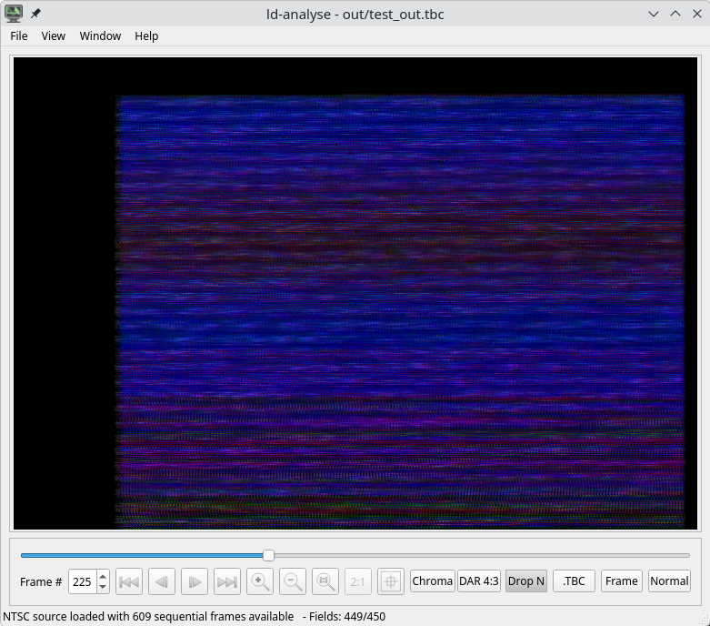
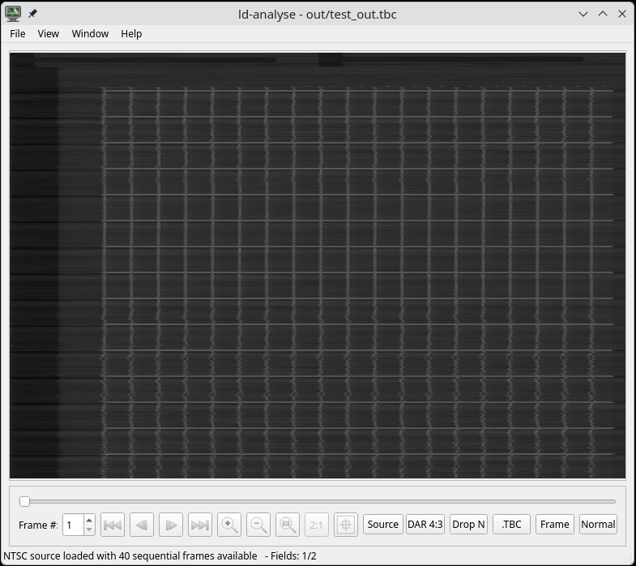
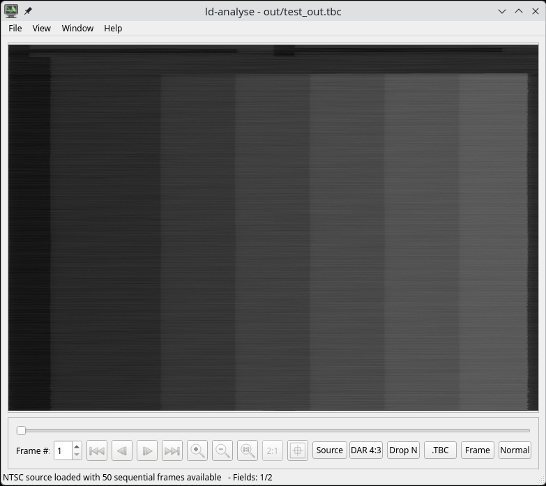

# Create LaserDisc RF with GNURadio

The goal of this project is, to use gnuradio to modulate a NTSC RF signal into a
Laserdisc compatible RF signal. To test the LD RF signal, I'm using
[tbc-tools](https://github.com/oyvindln/vhs-decode/wiki/Linux-Build).

I've created specialy for this project a [youtube channel](https://www.youtube.com/@DC6AP).


```bash
$> make decode


Unable to determine start of field - dropping field
Unable to determine start of field - dropping field
Unable to determine start of field - dropping field
Unable to determine start of field - dropping field
At field #0, Auto-level detection malfunction (vsync IRE computed at -13.2, nominal ~= -40), possible disk skipping
Frame 20/110000: File Frame 53: CAV Pulldown/Telecine Frame
At field #40, Auto-level detection malfunction (vsync IRE computed at -12.82, nominal ~= -40), possible disk skipping
Frame 44/110000: File Frame 77: CAV Pulldown/Telecine Frame
At field #88, Auto-level detection malfunction (vsync IRE computed at -12.73, nominal ~= -40), possible disk skipping
^Came 47/110000: File Frame 80: CAV Pulldown/Telecine Frame

$> make tbc
```


This picture shows a NTSC "Test Signal" (Dots and Squares), modulated with GNURadio
to LD-RF and demodulated with a PAL Laserdisc Player.


## Screenshots








